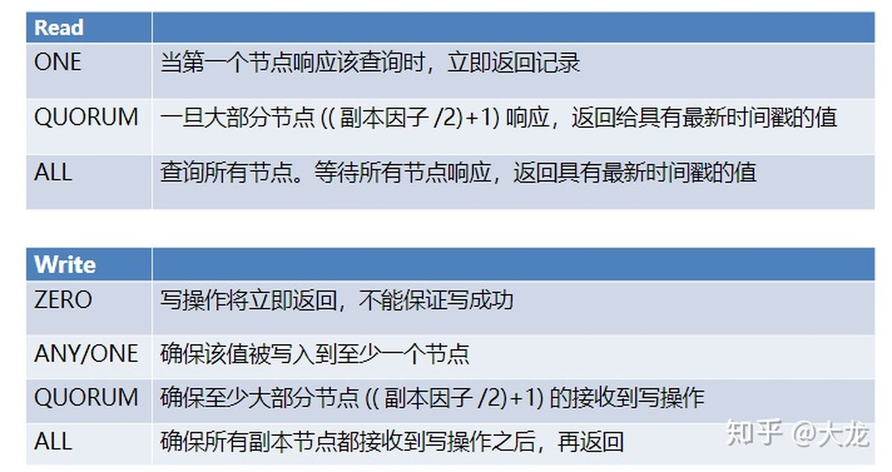
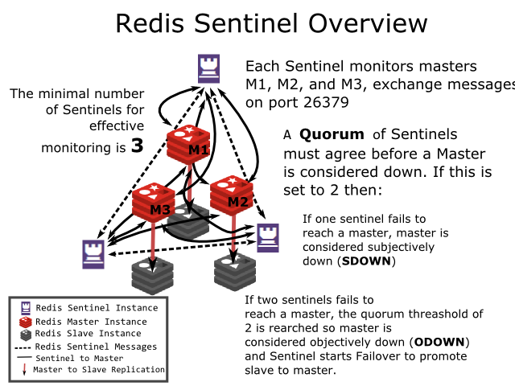
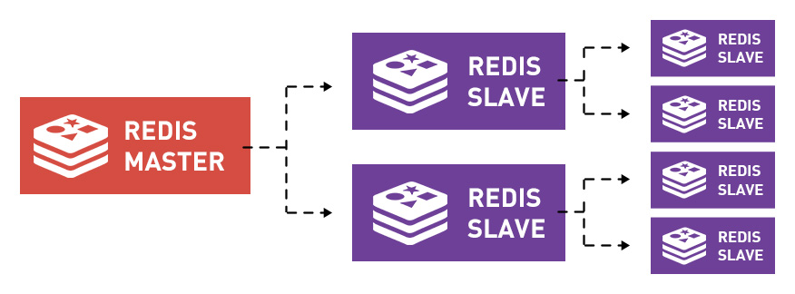

- [Redis](#redis)
  - [Redis为什么这么快？](#redis为什么这么快)
    - [I/O多路复用技术](#io多路复用技术)
      - [IO模式](#io模式)
  - [Redis支持的数据结构](#redis支持的数据结构)
    - [String](#string)
    - [List](#list)
    - [Hash](#hash)
    - [Set](#set)
    - [Sorted Set](#sorted-set)
  - [淘汰策略](#淘汰策略)
    - [noeviction](#noeviction)
    - [随机淘汰](#随机淘汰)
    - [LRU](#lru)
  - [Redis的分布式锁](#redis的分布式锁)
    - [锁的特性](#锁的特性)
    - [单节点锁实现](#单节点锁实现)
      - [SETNX](#setnx)
      - [超时时间设置](#超时时间设置)
    - [释放锁时先检查](#释放锁时先检查)
    - [综上总结](#综上总结)
    - [RedLock](#redlock)
      - [延迟重启](#延迟重启)
        - [如何解决一个Redis节点挂了出现锁被同时两个客户端获得的问题？](#如何解决一个redis节点挂了出现锁被同时两个客户端获得的问题)
        - [如何解决时间不一致导致的超时时间不一致问题？](#如何解决时间不一致导致的超时时间不一致问题)
      - [RedLock的问题](#redlock的问题)
        - [使用锁的用途](#使用锁的用途)
      - [RedLock的分布式实现](#redlock的分布式实现)
        - [续租满足特性](#续租满足特性)
  - [redis持久化](#redis持久化)
    - [触发时机](#触发时机)
    - [RDB](#rdb)
    - [AOF](#aof)
    - [混合持久化](#混合持久化)
    - [持久化方案的建议](#持久化方案的建议)
  - [Sentinel（哨兵）模式](#sentinel哨兵模式)
    - [Sentinel功能列表](#sentinel功能列表)
    - [节点发现功能](#节点发现功能)
    - [Sentinel API](#sentinel-api)
    - [故障检测—— S_DOWN以及O_DOWN状态的检测](#故障检测-s_down以及o_down状态的检测)
      - [S_DOWN](#s_down)
      - [O_DOWN](#o_down)
    - [故障恢复](#故障恢复)
      - [failover大概流程](#failover大概流程)
      - [最佳Slave选择，权重依次递减](#最佳slave选择权重依次递减)
  - [Cluster模式](#cluster模式)
    - [工作机制](#工作机制)
    - [优点](#优点)
    - [缺点](#缺点)
        - [参考：Redis集群详解（上）](#参考redis集群详解上)
    - [综上](#综上)
    - [集群主从复制数据同步](#集群主从复制数据同步)
      - [主从复制过程](#主从复制过程)
      - [全量复制](#全量复制)
        - [全量复制大致过程](#全量复制大致过程)
        - [全量复制大量IO操作和网络消耗如何解决？](#全量复制大量io操作和网络消耗如何解决)
      - [命令传播与增量复制](#命令传播与增量复制)
        - [异步广播会导致：如果一个子节点A短暂断连T秒，那么A再次恢复连接后改如何同步数据？](#异步广播会导致如果一个子节点a短暂断连t秒那么a再次恢复连接后改如何同步数据)
      - [读写分离和过期数据](#读写分离和过期数据)
    - [集群伸缩](#集群伸缩)
      - [集群扩容](#集群扩容)
        - [迁移过程中路由问题如何解决？](#迁移过程中路由问题如何解决)
        - [迁移的本质是什么？](#迁移的本质是什么)
      - [集群收缩](#集群收缩)
    - [集群故障自动检测与自动恢复](#集群故障自动检测与自动恢复)
      - [故障发现](#故障发现)
      - [广播信息](#广播信息)
      - [故障迁移](#故障迁移)
        - [1.资格检查](#1资格检查)
        - [2.休眠时间计算](#2休眠时间计算)
        - [3.休眠时间由两部分组成：](#3休眠时间由两部分组成)
        - [4.发起拉票&选举投票](#4发起拉票选举投票)
        - [5.替换节点](#5替换节点)
        - [6.集群配置更新](#6集群配置更新)
  - [监控与告警](#监控与告警)
    - [基础资源监控](#基础资源监控)
    - [Redis可用性、性能指标、错误](#redis可用性性能指标错误)
  - [其它](#其它)
  
# Redis

> Redis的全称是Remote Dictionary Server，是一个高效的内存键值数据库，常被用来做分布式的高速缓存，相比较我们常规使用的Mysql、MongoDB等数据库，Redis的最大特点在于数据读写全部在内存中进行，进而带来极大的效率优势。相比较其他的内存键值存储系统如Memcached， Redis支持更多的数据结构，极大的提升了使用的易用性。

## Redis为什么这么快？

1. `数据读写在内存中完成；（主要原因）`
2. 单线程请求处理；（多线程并行对数据读取有好处，但是也有数据写入锁的开销和线程上下文切换开销）
3. I/O多路复用技术。又称事件驱动，Redis基于[epoll](https://blog.csdn.net/HDUTigerkin/article/details/7517390)等技术实现了网络部分响应的同步非阻塞I/O模式；

### I/O多路复用技术

参考：[Redis详解（2）——Redis是如何做到单线程服务10000客户端的?](https://zhuanlan.zhihu.com/p/95840826)

​		[I/O多路复用技术（multiplexing）是什么？](https://www.zhihu.com/question/28594409)

#### IO模式

> 类Unix中，万物皆文件；每个文件都有一个唯一的[文件描述符](https://zh.wikipedia.org/wiki/%E6%96%87%E4%BB%B6%E6%8F%8F%E8%BF%B0%E7%AC%A6)fd(File Descriptor)来代表。文件有stdin、stdout、stderr三种标准流；

水房接水，类比read()函数读取文件，拧开有水表示可读，无水表示不可读或异常；

- 阻塞IO模式：一直在水房等待，直到接上水（变为可读）；即是调用read（）读取到内容或出错才返回；
- 非阻塞IO模式：发现没水立马返回，过一会儿再来查看是否有水；即无论文件可不可读，read函数都立马返回，如果可读就返回文件内容，如果不可读，就返回一个不可读标识符。

## Redis支持的数据结构

> 理论上，内存KV数据存储只需要支持字符串就能支持所有的数据类型存储；其他列表、字典，只需要将数据进行序列化就行；缺点就是修改需要每次获得所有数据再传回，I/O增加，使用体验不好；Memcached即是如此。

### String

> 存取序列化后的字符串，支持原生和数字字符串；存取复杂度为O(1);

| 命令 | 含义           |
| ---- | -------------- |
| set  | 设置键值       |
| get  | 获取给定键的值 |
| del  | 删除给定键的值 |

### List

> Redis底层采用*双向链表*实现；端点插入和查询O(1),中间位置获取连续多个值O(n);

| 命令          | 含义                      |
| :------------ | :------------------ |
| lpush/rpush   | 向列表 左端/右端 插入数据 |
| lpop/rpop     | 向列表 左端/右端 删除数据 |
| lrange/range | 去除从 左端/右端 开始计数的位置处于[start,end]之间的所有value |
| lindex/rindex | 删除从 左端/右端 开始计数的第index个值 |

### Hash

> 字典数据结构;采用`散列表`实现；类似于HashMap。

### Set

> 集合，满足集合`确定性、无序性、唯一性` 三个性质；散列表实现；

### Sorted Set

> 有序集合，满足唯一性和有序性；插入会指定一个Score作为排序标准。 Sorted Set的底层实现采用的是**Skip List**， 所以其单个元素的存取效率可以近似认为是O(logn)的。有序集合的操作命令主要如下：

```
ZADD KEY_NAME SCORE1 VALUE1
```

## 淘汰策略

> Redis把所有设置了过期时间的键放到一个单独的链表里面进行维护。内存不足时，会使用六大策略淘汰；

### noeviction

1. 不淘汰策略；表示Redis不主动清除键。清除动作由用户决定；当内存不够时；拒绝所有写入操作并返回客户端错误信息"(error) OOM command not allowed when used memory"，此时 Redis 只响应读操作。

### 随机淘汰

> 随机选取一些键进行删除；
2. allkeys-random：随机删除所有键，直到腾出足够空间为止；
3. volatile-random: 随机删除过期键，直到腾出足够空间为止；

### LRU

> Least Recently Used最近最少使用原则

4. allkeys-lru：根据 LRU 算法删除键，不管数据有没有设置超时属性，直到腾出足够空间为止。
5. volatile-lru(默认): 超过最大内存后，在`过期键`中使用 lru 算法进行 key 的剔除，保证不过期数据不被删除，但是可能会出现 OOM 问题。
6. volatile-ttl：设置了ttl（time to live） 属性，优先删除剩余时间短的key。如果没有，回退到 noeviction 策略。

## Redis的分布式锁

参考：[基于Redis的分布式锁详解](https://zhuanlan.zhihu.com/p/100140241)

> 锁的申明和释放一定要基于各个工作流都可见的区域来实现。分布式场景中，需要所有机器可见区域实现锁。同时在不稳定网络、机器不可靠、机器时间不一致等条件下满足锁的三个特性。

### 锁的特性

1. 互斥性；（同一时刻，一个锁只能被一个工作流持有；）
2. 避免死锁；
3. 容错（大部分节点创建了就可以）。

### 单节点锁实现

> 单节点Redis的锁实现主要有三大点： SETNX的使用、超时时间设置以及释放锁前先检查锁。

#### SETNX

```
SET key value [EX seconds] [PX milliseconds] [NX|XX]
# EX 单位s PX单位ms
# SET key value EX seconds 等同于执行 SETEX key seconds value
# NX key不存在才操作|XX key存在才操作
```

```c
def Job():
  identifier = str(uuid.uuid4())
  lock_name = "mylock"
  try:
    #一直循环等待获得锁
    while True:
        #如果获得锁c成功就完成工作并退出循环
        if lock(lock_name):
          do_something()
          break
  finally:
    #释放锁
    unlock(lock_name)
   
def lock(lock_name):
  return redis.setnx(lock_name, identifier)

def unlock(lock_name):
  redis.delete(lock_name)
```

#### 超时时间设置

> 不能完全依赖锁所有者主动释放，要给锁设置超时时间，超过时间未释放会被Redis强制释放。

```c
def lock(lock_name, lock_timeout):
  if redis.setnx(lock_name, identifier):
    redis.expire(lock_name,lock_timeout)
    return True
  return False 

def unlock(lock_name):
  redis.delete(lock_name)
```

### 释放锁时先检查

> 带有超时特性的锁满足了避免死锁的性质，但是这种auto release的机制的确很有可能破坏锁的互斥性质。通过get得到identifier，判断是否是自己存的identifier释放锁（避免释放其他线程或进程正在使用的锁）；

### 综上总结

1. **使用SETNX实现排他性锁；**
2. **使用超时限制特性来避免死锁；**
3. **释放锁的时候需要进行检查来避免误释放别的进程的锁。**

### RedLock

>  全称Redis Distributed Lock，**核心思想就在于使用多个Redis冗余实例来避免单Redis实例的不可靠性。** RedLock采用的就是依据法团准则（大于一半）的方案。



#### 延迟重启

##### 如何解决一个Redis节点挂了出现锁被同时两个客户端获得的问题？

- 假设A挂了，只有挂掉这个时刻A节点上所有锁受影响。之后创建的新锁或者没存储在A上的锁均不受影响；

- 每个锁都设置了超时时间，设置A延迟时间为 `MAX TTL`（会统计当前时刻所有节点的max）,这样即可保证当N0重新服务后，其上所有锁均会失效；

##### 如何解决时间不一致导致的超时时间不一致问题？

- 使用理论时间戳（即开始设置时，本地机器的时间戳+TTL）是最保险的方案，因为它肯定是最小的。
- 为了避免在获取锁的过程中因为网络的问题占用了过多的锁可使用时间，每次从一个机器获取锁的时候都只在网络上等待一个非常小的时间，超时还未获得锁就立马尝试下一个节点。

#### RedLock的问题

1. RedLock**可能的最大问题**在于**强依赖系统时间**。
2. 问题出现在**auto release的机制上**。自动超时释放但该线程或进程还在运行，但可被其他线程或进程拿到；

##### 使用锁的用途

1. 效率第一，比如我们不想让一个耗时的任务被重复的执行;
2. 正确第一，为了程序的正确性考虑。

[RedLock争议](https://zhuanlan.zhihu.com/p/101216704)

#### RedLock的分布式实现
参考：[分布式锁](./../architectural-approach/classic-architecture/分布式锁.md)

##### 续租满足特性

1. 如果程序正常运行，但是锁的超时时间快到了，那么就应该续租；
2. 如果程序终止，则停止续租；
3. 如果程序使用锁期间，陷入死循环，则停止续租。

## [redis持久化](https://www.cnblogs.com/richiewlq/p/12191261.html)

> 存储可cache-only|persistence

### 触发时机

- 手动触发

- 自动触发

### RDB

> 全称redis database；在指定的时间间隔内将内存中的数据集快照写入磁盘，也就是行话讲的Snapshot快照，它恢复时直接将快照文件直接读到内存里。

- 主要配置

  - save 900 1 # 在900s内存在至少一次写操作

  - save "" # 禁用RBD持久化

  - stop-writes-on-bgsave-error yes # 当备份进程出错时主进程是否停止写入操作

  - rdbcompression no  # 是否压缩rdb文件 推荐no 相对于硬盘成本cpu资源更贵

- 与AOF相比，RDB文件相对较小，恢复数据比较快;

- 服务器宕机，RBD方式会丢失掉上一次RDB持久化后的数据;

- 使用bgsave `fork子进程`(会拷贝所有父进程数据)时会耗费内存;Unix类操作系统上面，做了如下的优化：在刚开始的时候父子进程共享相同的内存，直到父进程或者子进程进行内存的写入后，对被写入的内存共享才结束。这样就会减少Redis持久化时对内存的消耗。

### AOF

> AOF全称Append Only File，以redis执行过的所有写指令记录下来（读操作不记录），只许追加文件但不可以改写文件，redis启动之初会读取该文件重新构造数据，换言之，redis重启的话就根据日志文件的内容将写指令从前到后执行一次以完成数据的恢复工作。**AOF重写**用于删除掉冗余的命令。


- 主要配置

  - appendonly no # 默认关闭AOF，若要开启将no改为yes；

  - appendfilename "appendonly.aof" # append文件的名字；

  - appendfsync everysec # 每隔一秒将缓存区内容写入文件 默认开启的写入方式；

  - auto-aof-rewrite-percentage 100 # 当AOF文件大小的增长率大于该配置项时自动开启重写（这里指超过原大小的100%）。

  - auto-aof-rewrite-min-size 64mb # 当AOF文件大小大于该配置项时自动开启重写。

- AOF只是追加文件，对服务器性能影响较小，速度比RDB快，消耗内存也少，同时可读性高。

- 生成的文件相对较大，即使通过AOF重写，仍然会比较大；

- 恢复数据的速度比RDB慢；

### 混合持久化

- 4.0版开始支持；

- 兼容性差，一旦开启了混合持久化，在4.0之前的版本都不识别该持久化文件；

- aof-use-rdb-preamble yes # 开启混合持久化。

### 持久化方案的建议

- 如果Redis只是用来做缓存服务器，比如数据库查询数据后缓存，那可以不用考虑持久化，因为缓存服务失效还能再从数据库获取恢复；

- 如果你要想提供很高的数据保障性，那么建议你同时使用两种持久化方式。如果你可以接受灾难带来的几分钟的数据丢失，那么可以仅使用RDB；

- 通常的设计思路是利用主从复制机制来弥补持久化时性能上的影响。即Master上RDB、AOF都不做，保证Master的读写性能，而Slave上则同时开启RDB和AOF（或4.0以上版本的混合持久化方式）来进行持久化，保证数据的安全性。

## Sentinel（哨兵）模式

参考：[Redis Sentinel Documentation](https://redis.io/topics/sentinel)

[Redis哨兵——主从节点的故障的检测与恢复](https://zhuanlan.zhihu.com/p/103982258)



> Redis高可用方案，实现了自动的故障检测与恢复、服务发现以及应用端的故障提示。

### Sentinel功能列表

- **Monitoring**：Sentinel持续的监控 Master节点、Slave节点以及其它Sentinel节点是否健康。
- **Automatic failover**：当前的Master节点故障时，Sentinel会选择一个Slave节点来替换当前Master节点，并配置其他的Slave节点成为新的Master节点的从节点。同时Sentinel会通知客户端新的Master的地址。
- **Notification**：当监控的集群节点出故障时，Sentinel可通过执行特定脚本、订阅来告知系统管理员或者其它应用程序来通知相应信息。
- **Configuration provider**：当集群中发生failover时，应用方可从Sentinel获得新的Master节点和Slave节点的地址。

### 节点发现功能

```
sentinel monitor <master-group-name> <ip> <port> <quorum>
#配置
sentinel monitor mymaster 127.0.0.1 6379 2 # 两个发团判定即可
sentinel down-after-milliseconds mymaster 60000 # PING命令超时时间
sentinel failover-timeout mymaster 180000 # failover超时时间
sentinel parallel-syncs mymaster 1 # 并行复制个数，如果为2，Master同一时刻要把数据发往两个节点
```

- Sentinel会监控其它所有的节点（Sentinel、Master、Slave），但启动配置时只配置了Master；其它节点是如何被发现呢？Sentinel启动后，会定时向Master发送INFO命令。

  命令返回：

  ```
  # 启动了两个Redis实例，Redis1端口为6666， Redis2端口为7777，Redis2的为Redis1的从节点。
  # 我们对Master节点发送INFO命令，下述为部分输出结果。
  
  # Replication
  role:master
  connected_slaves:1
  slave0:ip=127.0.0.1,port=7777,state=online,offset=0,lag=2
  master_repl_offset:15
  repl_backlog_active:1
  repl_backlog_size:1048576
  repl_backlog_first_byte_offset:2
  repl_backlog_histlen:14
  ```

### Sentinel API

sentinel节点支持的命令有（不完全）：

- **PING**: 返回PONG，用于测试该sentinel节点是否网络可达;
- **SENTINEL Masters**：返回该sentinel节点所监控的所有master节点;
- SENTINEL master \<master name> ：返回特定master节点的信息;
- SENTINEL slaves \<master name>: 返回特定master节点的所有slave节点信息，常用于读写分离时应用端获得所有的slave地址用于读取数据。

### 故障检测—— S_DOWN以及O_DOWN状态的检测

> S_DOWN(Subjectively-DOWN,主观下线)|O_DOWN（Objectively-DOWN，客观下线）

#### S_DOWN

> Sentinel会定时向所有被监控的节点发送`PING`和`INFO`命令，**PING**用于检测监控节点是否网络可达，**INFO**用于获得节点信息。

1. 如果超过**down_after_period**还未收到被监控节点的PING命令的**有效恢复**（**PONG**、**LOADING**或者**MASTERDOWN**），那么Sentinel就认为该节点主观下线。
2. 如果Sentinel标记被监控的节点为master节点，但是从被监控节点得到的INFO命令回复内容显示该节点为Slave节点（说明发生了failover），则认为该节点主观下线。一个Sentinel节点判定主观下线时，会设置对应的被监控节点处于S_DOWN状态。
3. 一个sentinel节点判定某被监控节点处于S_DOWN时会接着去查看其他sentinel节点对该节点的状态监测结果来进一步判定该节点是否真正下线，如果大部分sentinel节点都判定该节点处于`S_DOWN`状态，那么该节点会被标记为`O_DOWN`状态。

**Sentinel只对Master节点做O_DOWN状态判断，对Slave节点和其他Sentinel节点只做S_DOWN状态判断。**

#### O_DOWN

> 如果发现超过qurom个sentinel节点都判断master节点为S_DOWN，那么sentinel节点就会判定该节点处于O_DOWN状态。

**判定Master节点为O_DOWN时，就需要发起failover流程来让一个好的slave节点来替换掉现在的故障master节点，成为新的master节点。**

### 故障恢复

1. 设置新的Master节点替换掉原来的故障Master节点；
2. 设置其他的节点成为新的Master节点的Slave节点用于主从复制；
3. 告知客户端新的master节点地址信息，同时执行必要的脚本来通知系统管理员。

#### failover大概流程

1. 投票选出哨兵Leader；
2. 由Leader哨兵选出替换故障Master的最佳Slave；
3. 将通过订阅发布目前的Master信息。

#### 最佳Slave选择，权重依次递减

1. 根据指定的优先级选择（0~100），所有节点priority相同，进行第二步；
2. 根据数据更新程度选择。所有 slave 节点复制数据时都会记录复制偏移量（slave_repl_offset），值越大说明与master数据更一致。会选择最大的；所有一样进行第三步；
3. 根据runid选择；每个节点启动都会有一个唯一的runid，选择最小的。

## Cluster模式

```
HASH_SLOT = CRC16(key) mod 16384
```

### 工作机制

- 在Redis的每个节点上，都有插槽（slot），取值范围为0-16383。

- 当我们存取key的时候，Redis会根据CRC16的算法得出一个结果，然后把结果对16384求余数，这样每个key都会对应一个编号在0-16383之间的哈希槽，通过这个值，去找到对应的插槽所对应的节点，然后直接自动跳转到这个对应的节点上进行存取操作。

- 为了保证高可用，Cluster模式也引入主从复制模式，一个主节点对应一个或者多个从节点;当主节点宕机的时候，就会启用从节点。

- 当其它主节点ping一个主节点A时，如果半数以上的主节点与A通信超时，那么认为主节点A宕机了。如果主节点A和它的从节点都宕机了，那么该集群就无法再提供服务了。

### 优点

- 无中心架构，数据按照slot分布在多个节点。

- 集群中的每个节点都是平等的关系，每个节点都保存各自的数据和整个集群的状态。每个节点都和其他所有节点连接，而且这些连接保持活跃，这样就保证了我们只需要连接集群中的任意一个节点，就可以获取到其他节点的数据。

- 可线性扩展到1000多个节点，节点可动态添加或删除。

- 能够实现自动故障转移，节点之间通过gossip协议交换状态信息，用投票机制完成slave到master的角色转换。

### 缺点

- 客户端实现复杂，驱动要求实现Smart Client，缓存slots mapping信息并及时更新，提高了开发难度。目前仅JedisCluster相对成熟，异常处理还不完善，比如常见的“max redirect exception”。

- 节点会因为某些原因发生阻塞（阻塞时间大于 cluster-node-timeout）被判断下线，这种failover是没有必要的。

- 数据通过异步复制，不保证数据的强一致性。

- slave充当“冷备”，不能缓解读压力。

- 批量操作限制，目前只支持具有相同slot值的key执行批量操作，对mset、mget、sunion等操作支持不友好。

- key事务操作支持有线，只支持多key在同一节点的事务操作，多key分布不同节点时无法使用事务功能。

- 不支持多数据库空间，单机redis可以支持16个db，集群模式下只能使用一个，即db 0 Redis。

- Cluster模式不建议使用pipeline和multi-keys操作，减少max redirect产生的场景。

##### 参考：[Redis集群详解（上）](https://zhuanlan.zhihu.com/p/104641341)

### 综上

1. 对于分布式存储，数据分区规则是核心问题之一，Redis集群中使用的是虚拟槽/虚拟桶分区，使用CRC16函数计算每个键的哈希值，并把所有的键划分到16384个桶中。
2. 数据存储在各个节点之后，当客户端访问键时，需要能够知道键所在的节点地址，Redis集群没有采用代理的方案，而是每个节点都保存集群中槽的负责节点信息，客户端可连接任意一个节点，当该节点发现客户端请求的键并不由自己负责时，会向客户端返回重定向，重定向中包含着负责该键的节点地址信息。
3. 同路由信息一样，Redis的集群元数据信息也是存储在各个节点上，并使用Gossip协议来完成集群的元数据同步。每个集群节点会每100ms向部分节点随机传输自己视角下的N/10个节点的信息，同时Redis集群节点会努力保证自己与其他的所有节点每node_timeout/2时间内至少通信一次。

### 集群主从复制数据同步

参考：[Redis集群——主从复制数据同步](https://zhuanlan.zhihu.com/p/102859170)

>主从复制，是指将一台Redis服务器的数据复制到其他的Redis服务器，前者称为主节点(master/leader)，后者称为从节点(slave/follower)。一个主节点可以有多个从节点(或没有从节点)，但一个从节点只能有一个主节点，同时每个从节点也可以是别的从节点的父节点，即主从节点连接形成树结构。



#### 主从复制过程

参考：[深入学习Redis（3）：主从复制](https://www.cnblogs.com/kismetv/p/9236731.html) 

​	 [Redis集群——主从复制数据同步](https://zhuanlan.zhihu.com/p/102859170)

> `主从复制都是从节点发起的；复制是单向的，只能由主节点到从节点。`

1. 建立连接阶段
   1. 保存主节点信息；
   2. 建立socket连接；
   3. 发送ping命令；
   4. 身份验证；
   5. 发送从节点端口信息；
2. 数据同步阶段
   - 从节点向主节点发送psync命令（Redis2.8以前是sync命令），开始同步。
   - 建立连接阶段slave变为master的客户端；而数据同步和命令阶段互为客户端（master需要主动向slave发送请求）；
   - 可分为`全量复制（RDB）`|`部分复制（AOF）`。
3. 命令传播阶段
   - master将自己执行的写命令发送给slave执行保证主从数据的一致性；
   - 是延迟且不一致的；命令传播是异步，有一定延迟性；

#### 全量复制

> **全量复制的核心就是把Master节点当前的数据全部发送给子节点;**

##### 全量复制大致过程

1. Master节点开启子进程进行RDB文件生成；
2. Master节点将RDB文件发送给Slave节点；
3. Slave节点清空内存中的所有数据并删除之前的RDB文件；
4. Slave节点使用从Master接收的RDB文件恢复数据到内存中；

##### 全量复制大量IO操作和网络消耗如何解决？

> 命令传播+增量复制。

#### 命令传播与增量复制

> 当Master处理完一个命令会广播给所有的slave，而slave接收到Master命令也会在处理完后广播给自己的所有slave；`广播是异步操作`；
>
> 异步操作即Master处理完客户端命令会立马向客户端返回结果，不会一直等待所有子节点都确认完成操作再返回以保证Redis的高性能；

##### 异步广播会导致：如果一个子节点A短暂断连T秒，那么A再次恢复连接后改如何同步数据？

> Redis会开辟一个缓冲区（默认1M），每次处理完先写入缓冲区repl_backlog，再发送给slave——即增量复制（部分复制）。
>
> 缓冲区命令长度有限，为repl_backlog_length，如果slave落后最新命令大于repl_backlog_length，就会触发全量复制。

#### 读写分离和过期数据

1. 由于主从复制是单向，所以从节点对外是`只读的`；
2. 从节点可以参与读请求以有效分摊Master的压力；但是从节点有一定延迟性；尤其在Master删除数据，由于网络等问题未及时到达slave从而让用户读到过期的数据；
3. 为了解决2问题，Redis从3.2版本之后，子节点也可以主动判断用户请求的键是否已经过期。如果过期，则就不向用户返回结果，但是并不会直接删除数据。删除数据的操作仍然是只会由Master节点的同步引起。这实际上是对主从的时钟同步是有要求的，绝大部分情况下这个先决条件还是能够被满足的。

### 集群伸缩

参考：[Redis集群(中) —— 集群伸缩](https://zhuanlan.zhihu.com/p/105569485)

- 伸缩本质是slot在不同节点之间的迁移；需要解决数据路由问题；
- 扩缩容最核心的地方还是数据的迁移；
- 扩容添加新节点后，需要向整个集群广播slot被新的节点负责的信息，而集群收缩下线节点时，需要向集群广播让所有节点forget掉下线节点。
- 同时在数据迁移过程中，我们需要解决的很重要的问题就是数据路由问题，Redis通过ASK重定向和MOVED重定向解决了该问题。

#### 集群扩容

> Redis集群没有实现负载均衡，slots迁移由用户指定。

1. 准备新节点；
2. 加入集群；
3. 迁移slot到新节点。

##### 迁移过程中路由问题如何解决？

> 设置节点slot的迁入迁出状态。（migrating表示源solt；importing表示目标节点solt）
>

##### 迁移的本质是什么？

> 将slot中的键值搬迁；两个非集群模式也可使用**migrate**进行迁移。
>
> 键值迁移结束后，会向集群每个节点广播该slot所处节点的消息。

#### 集群收缩

> 即让其中一些节点安全下线。所谓的安全下线指的是让一个节点下线之前我们需要把其负责的所有slots迁移到别的节点。

### 集群故障自动检测与自动恢复

参考：[Redis集群（终篇）——故障自动检测与自动恢复（附优质Redis资源汇总）](https://zhuanlan.zhihu.com/p/106110578)

> 让下线Master节点的Slave节点来成为新的Master节点，接管旧Master负责的所有slots向外提供服务。

- 当集群中一个Master故障后，让其slave代替继续向外提供服务。称为**slave promotion**。
- 当集群一个Master节点为**Orphaned Master**节点时，会从其他有富余slave的地方迁移过来一个slave给这个孤立节点。

#### 故障发现

> 采用多数投票的方案。

- redis每个节点会向其它节点发送PING消息来同步信息同时检测其它节点是否可达；当节点发现有其它节点断连时间超过node_timeout时，会标记该节点为`PFAIL`，即`Possible failure`，可以中文意为主观下线。
- 发现PFAIL后，该节点会通过Gossip消息发送给其他节点，其他节点（认为所报告的节点为PFAIL）会进行客观下线状态判断。
- 超过1/2数目节点数同样认为该节点为PFAIL，即可判定为FAIL。并会立刻广播这个信息。

#### 广播信息

> 向全集群广播标记为FAIL的信息CLUSTERMSG_TYPE_FAIL。接收到的节点均会更新自己维护的节点状态信息。

#### 故障迁移

> 当FAIL状态节点的子节点接收到信息后，就会开始发起故障迁移，竞选成为新的Master；当多个子节点时，参与竞选都会首先检查自身是否有资格竞选。

##### 1.资格检查

> Redis认为，当一个Slave节点过长时间不与Master节点通信，即为不具备参选资格；

##### 2.休眠时间计算

> 采用Raft协议选举。首先参与选举的节点随机休眠一段时间，一旦唤醒立刻向所有的投票节点发起拉票请求。对于投票节点，每轮选举只能投一票；投票规则就是先到先得；一般休眠最短的节点容易获得大部分投票。

##### 3.休眠时间由两部分组成：

1. 固定的500ms。这500ms主要为了等待集群状态同步（确保集群的所有阶段都收到了消息并更新了状态）。
2. 随机加上该Slave节点的排名决定的附加时间。（偏移量越大，排名越高）


```
DELAY = 500 milliseconds + random delay between 0 and 500 milliseconds + SLAVE_RANK * 1000 milliseconds.
```

##### 4.发起拉票&选举投票

- 所有的节点（主+从）均会收到拉票请求，但只有主节点才具备投票资格。
- 主节点收到拉票请求，如果本轮该主节点没有投出票，即会投给发送方，回复*FAILOVER_AUTH_ACK*消息；当有节点获得ACK消息一半以上就会开始执行failover，即替换自己的主节点过程。

##### 5.替换节点

1. 首先标记自己为主节点；
2. 将原master节点负责的slot标记为自己负责；
3. 向整个集群广播自己是Master的信息；其它节点接收到消息后会更新自己维护的状态信息。

##### 6.集群配置更新

> 新的节点成为Master后，当前故障Master重新上线后，会自动成为其子节点；之前的Slave亦是。

*综上故障迁移步骤：*

1. 子节点竞选资格检查；
2. 子节点休眠时间计算；
3. 子节点发起拉票，其他主节点投票；
4. 获得多数票的子节点替换其主节点并向集群所有节点广播该信息；
5. 其他节点接收信息后更新配置；
6. 原先主节点以及其Slave自动成为新的主节点的Slave。

## 监控与告警

参考：[How to Monitor Redis](https://blog.serverdensity.com/monitor-redis/)

> 收集所有有助于故障排除的指标；

### 基础资源监控

1. CPU使用情况；
2. 存储情况：
   1. 内存使用情况，Swap交换区使用情况（类似于虚拟内存，有使用说明性能下降厉害）；
   2. 硬盘情况；
3. 网络情况；带宽、连接数等

### Redis可用性、性能指标、错误

- 可用性和查询
  - connected_clients（连接数）
  - keyspace（数据库总键数）
  - instantaneous_ops_per_sec（每秒处理命令数）
  - hit rate (calculated) =keyspace_hits / (keyspace_hits + keyspace_misses) (命中率)
  - rdb_changes_since_last_save（自上次存储以来对数据库的更改数（重启会丢失的数据数））
  - connected_slaves（该Master的Slave数）
- 性能
  - latency（响应查询平均时间）
  - used_memory（使用的内存）
  - evicted_keys（达到最大内存而被淘汰的键数）
  - blocked_clients（被阻塞处于等待的客户端数目）
- 错误
  - rejected_connections（达到最大连接数被拒绝的连接数）
  - keyspace_misses（失败键查找次数）
  - master_link_down_since_seconds（主从断开时间）

## 其它

- 参数解读

- 运维经验

  - [优酷蓝鲸近千节点的 Redis 集群运维经验总结](https://www.infoq.cn/article/2016/08/youku-Redis-nosql?utm_source=related_read&utm_medium=article)

  - [Redis 内存使用优化与存储](https://www.infoq.cn/article/tq-redis-memory-usage-optimization-storage?utm_source=related_read&utm_medium=article)

  - [阿里云 Redis 开发规范](https://www.infoq.cn/article/K7dB5AFKI9mr5Ugbs_px?utm_source=related_read&utm_medium=article)

